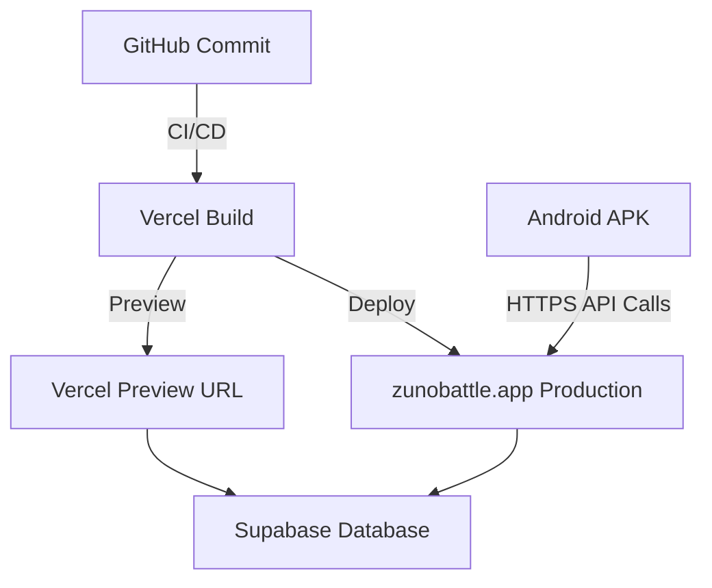

# ZUNO Architecture

Version: 1.0  
Status: Active

---

```mermaid
graph TD
  A[Unity Client (Android)] -->|HTTPS REST| B[Next.js Serverless API (Vercel)]
  B --> C[Supabase Auth + RLS]
  C --> D[Postgres Database]
  D --> E[Repositories]
  E --> F[Services]
  F --> G[API Routes / Handlers]
```

## Components

### Unity Client (Android)
* Primary game client with rendering, input, and gameplay logic.  
* Communicates with backend via HTTPS endpoints.  
* Stores non‑authoritative local preferences synced via Cloud Save.  

### Next.js Backend / Website
* Dual‑purpose: public site + serverless API.  
* Implements `/api/v1/...` routes for every gameplay domain.  

### Supabase
* Backend‑as‑a‑service providing Postgres + Auth.  
* Row‑Level Security ensures user data isolation.  
* Schema migrations managed through Git‑versioned SQL.  

### Vercel
* CI/CD hosting for both web and API deployment.  
* Handles preview / production environments automatically.  

### GitHub
* Canonical source of truth.  
* Vercel builds triggered directly from pushes and tags.  

---

## Future Multiplayer Architecture
* Real‑time service for matchmaking and presence.  
* Deterministic server simulation validated by authority.  
* Possible expansion using Supabase Realtime or custom relay.  

---

## Coding Conventions

| Element | Convention |
|----------|-------------|
| TypeScript files | camelCase filenames |
| Interfaces / Types | PascalCase |
| React components | PascalCase |
| API routes | lowercase-hyphenated |
| DB tables | snake_case |
| DB columns | snake_case |
| Constants | UPPER_CASE |
| Docs | Capitalized_Names_With_Underscores |

---

## Deployment Flow

